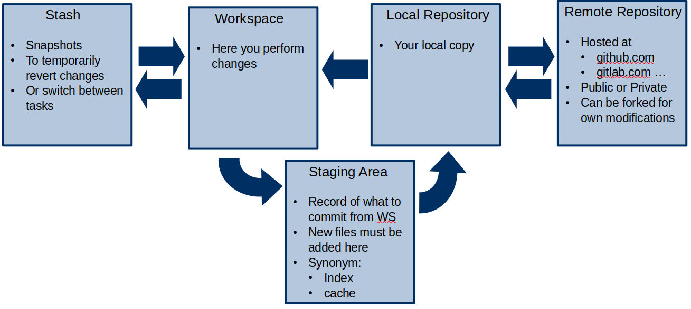

```{r setup, include=FALSE}
options(tidyverse.quiet = TRUE)

library(glue)
library(knitr)
library(tidyverse)
library(patchwork)
library(ragg)
library(xaringanthemer)
library(RefManageR)

knitr::opts_chunk$set(
  echo = FALSE,
  warning = FALSE,
  message = FALSE,
  error = FALSE,
  fig.align = 'center',
  fig.show = "hold",
  dev = "ragg_png",
  fig.retina = 3,
  comment = ""
)

HITS_COL <- "#1E4287"
HITS_GREEN <- "#019050"
HITS_MAGENTA <- "#c3006b"
HITS_YELLOW <- "#ffcc00"

theme_set(ggthemes::theme_tufte(base_family = "Roboto") %+%
          theme(plot.title.position = "plot")
)

style_mono_accent(
  # title_slide_background_image = "img/some_image.png" # relative to the file path of xaringan_themer.css,
  base_color = HITS_COL,
  header_h1_font_size = "40px",
  header_h2_font_size = "30px",
  header_h3_font_size = "20px",
  header_font_family = "Miriam Libre, sans-serif",
  header_color = "black",
  text_font_family   = "Roboto, sans-serif",
  code_font_family = 'Fira Code',
  header_font_weight = '450',
  outfile = "assets/www/xaringan_themer.css"
)

xaringanExtra::use_tile_view()
xaringanExtra::use_panelset()
xaringanExtra::use_animate_css()
xaringanExtra::use_tachyons()
```


class: center, middle

.w-40.center[

]

by Kai and Jannik


???
Jannik

---

layout: true

.my-footer[
<span> Introduction to git and GitHub by [Kai](https://www.h-its.org/people/kai-riedmuller/) and [Jannik](https://jmbuhr.de/)</span>

]

---

## The Problem(s)

.center.w-50[

]

.gray[From: Bryan, J. 2017. “Excuse Me, Do You Have a Moment to Talk about Version Control?” PeerJ Prepr. https://doi.org/10.7287/peerj.preprints.3159v2.]

---

## Why should you use git?

- Reproducibility
- Collaboration
- Fearless experimentation
- Not just for (big) software projects, you can track your analysis, too!

---

## What is git?

A version control system based on fancy math graph theory

> Think of it as **Track Changes on steroids**

---

## Concepts

.pull-left[
commits

```text
A <-- B <-- C <-- D
```

branches

```text
A <-- B <-- C <-- D
            ^
             \
              --- E <-- F
```
]

.pull-right[

merging

```text
A <-- B <-- C <-- D <---- M
            ^            /
             \          v
              --- E <-- F
```

rebasing

```text
A <-- B <-- C <-- D 
                  ^            
                   \          
                    --- E <-- F
```
]

---

## Concepts

.pull-left[



]

.pull-right[


.gray[From: Wilson, Damien Irving, Kate Hertweck, Luke Johnston, Joel Ostblom, Charlotte Wickham, and Greg. n.d. Research Software Engineering with Python. Accessed July 12, 2021. https://merely-useful.tech/py-rse/]

]

???
Kai

---

## How do you use git (and GitHub)?

.demo[
Demo time!
]

<style>
.demo {
  margin: auto;
  text-align: center;
  background: #019050;
  color: white;
  font-size: 2rem;
  display: block;
  width: fit-content;
  padding: 5px 20px;
  border: 3px solid black;
  transition: all 0.2s
}
.demo:hover {
  font-size: 3rem;
}
</style>

???
Things to mention / show:

- Setting up ssh with git and GitHub,
- Talk about git `config --global`
  - `pull.rebase`
  - `init.defaultBranch`
  - `user.name`
  - `user.email`
- Using git with other tools: **vs code extension**(s), **GitHub Desktop**
- A remote repo doesn't have to be on github, it can also just be a folder on the hits file-system accessed via ssh!

Demonstrate:

- "This code doesn't run as expected": **GitHub Issues**
- "Indeed, I can fix it": **git branches**
- "This is what I did, can you include it in the main code?": **Pull Request**
- "Let me review those fixes": **code review**
- "Looks good now, ready to": **Merge**

Show:

- This works across repositories as well: **forks** and **Pull Requests** for contributing to Open Source Software
- e.g. <https://github.com/rstudio/rmarkdown/pull/1996>


https://missing.csail.mit.edu/2020/version-control/

---

## Collaborative Features of GitHub

- Issues
- Organizations, have:
  - Members
  - Repos
  - Teams
  - Projects
- Forks (and Pull Requests)

---

## Git can be hard...


But there is always help: <https://github.com/hits-mbm-dev/git-intro#resources>

